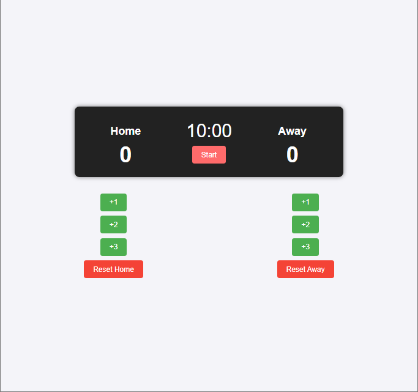

# Basketball Scoreboard

This project is a simple basketball scoreboard built using HTML, CSS, and JavaScript. It displays the score for two teams (Home and Away) and includes controls to increment the score for each team, reset the scores, and start a game timer.

## Features

- **Display Scores**: Shows the current score for both the Home and Away teams.
- **Add Points**: Buttons to add 1, 2, or 3 points to each team’s score.
- **Reset Scores**: Buttons to reset each team’s score to 0.
- **Game Timer**: A countdown timer that starts at 10:00 and decreases every second once the "Start" button is clicked.

## Live Demo

You can try the app live here: [Live Demo](https://scrimba-horatio-basketball-scoreboard.netlify.app)

## Screenshot




## Getting Started

### Prerequisites

To run this project, you just need a modern web browser.

### Installation

1. Clone this repository to your local machine:

   ```bash
   git clone https://github.com/your-username/basketball-scoreboard.git

## How to Use
1. Add Points: Click the +1, +2, or +3 buttons for either team to add points to their score.
2. Reset Scores: Click the Reset Home or Reset Away buttons to reset the respective team’s score to zero.
3. Start Timer: Click the Start button to start the countdown timer (starting from 10 minutes).

## Technologies Used
- **HTML5:** For structuring the content of the scoreboard.
- **CSS3:** For styling the layout and making the scoreboard visually appealing.
- **JavaScript:** For adding interactivity, such as updating scores and controlling the game timer.
